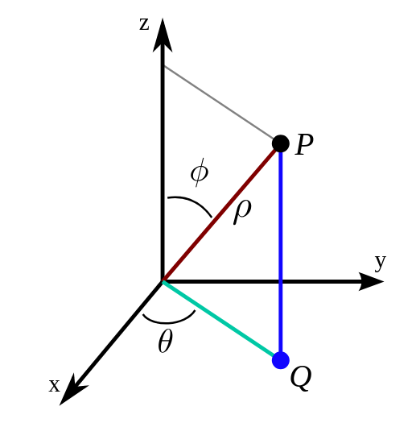

```{r echo=FALSE}
library(knitr)
library(rgl)
knit_hooks$set(webgl = hook_webgl)
setwd("/home/ada/Desktop/Notes/adas-world/X-Midas/")
```

## Overview

This document is a proof of concept for rendering recorded waveform to a 3D plot using various functions in R. A directional microphone was used to record data in 3 sessions. In the recording sessions, the microphone was spun 360 degrees in approximately 10 seconds and the microphone was either oriented to be -45 degrees, 0 degrees, or 45 degrees. 

Afterwords, the raw waveforms were loading into R and the azimuth and elevation for each waveform were calculated. The result was a dataframe containing spherical coordinates for each sample (an azimuth, elevation, and a magnitude). To facilitate rendering to a 3D plot, each sample was then converted into an X,Y,Z coordinate system. Next, the X,Y,Z coordinates were all appended to a 3D plot. Lastly, after rendering to 3D, the data was reprocessed and rendered as a series of 2D plots.

## Libraries
The code chunk in this section details the various libraries that were required for extracting, processing, and rendering the recorded data.

```{r setup , warning=FALSE, message=FALSE}
knitr::opts_chunk$set(message = FALSE, warning = FALSE)
library(knitr)
library(rgl)
library(tuneR)
library(geometry) 
library(rgl)
library(plot3D)
library(plot3Drgl)
library(ggplot2)
library(dplyr)
```

## Recording and Extracting Data

### Recording
The recording was conducted in 3 10 second sessions, where the microphone was rotated 360 degrees and set to an elevation of -45, 0, and 45 degrees, shifting before each session. The recordings were stored in a WAV format, with a sample rate of 22,000 samples per second. 


### Extracting

The _tuneR_ package was used in this section to extract the values in the WAV recordings and store them in a vector. The code chunk in this section is that process and shows the first 100 samples of one of the recordings.

```{r class.source = 'fold-show'}
#library(tuneR)
#setwd() #set the directory to recordings DIR
wav1 <-readWave("a1L.wav") #Naming Convection a1L = audio recording-source 1-Low orientation
a1L.r <- wav1@left 
head(a1L.r, n = 100) #Show the first 100 Samples.
```

Below are the samples, but with all 233200 samples plotted.

```{r fig.align="center", }
ggplot(mapping = aes(x=seq(1,length(a1L.r)),y=a1L.r)) +geom_point(size=.2) + xlab("Samples") + ylab("magnitude") + ggtitle("Raw WAV Values")
```

## Processing Data

### Adding Missing Orientation Values (Azimuth and Elevation)
The recording did not capture the orientation of the microphone, so it needs to be generated. Starting with the Azimuth, this is trivial if uniform circular motion of the microphone from 0 to 360 degrees is assumed over the 10 second duration. So, generate a one dimensional array of 233200 consecutive numbers between 0 and 360. In the code chunk below, such an array is generated and stored. The first 50 elements are printed to show what the values look like. 

```{r class.source = 'fold-show'}
a1L.az <- seq(0, 360, length=length(a1L.r)) ## Generate and Store the Array
head(a1L.az, n = 50) ## Print the first 50 elements
```

The result is now each sample has a magnitude and an azimuth. Next, the elevation data needs to be added for each sample. This is simple since the elevation was constant during the recording, which was -45 degrees for this data in particular. In R, just add a constant -45 for each of the 233200 samples.

```{r class.source = 'fold-show'}
a1L.el <- rep(-45, length=length(a1L.r)) ## Generate and Store the Array of constants
head(a1L.el, n = 50) ## Print the first 50 elements
```

*As long as the starting orientation and duration is known and the change is monotonically increasing or decreasing, then the missing orientation values can be recovered (even if both azimuth and elevation are changing)*

_Note: Everything in this section was accomplished in base R and did not require additional libraries_

### Conversion From Spherical To Cartesian Coordinates

At this time, the magnitude, azimuth, and elevation for each sample are stored memory. The next step is to convert from spherical coordinates to Cartesian coordinates. 

#### Mathematical Background

In the image below, the Cartesian coordinate system is the left figure and the spherical coordinate system is listed on the right. The objective is to convert from the spherical coordinate system (SCS) to the Cartesian coordinate system (CCS). The angle $\theta$ (theta) of the XY-Plane in the CCS directly corresponds to the azimuth in the SCS. The angle $\phi$ (phi) of the CCS is closely related to the elevation of the SCS. Basically, calculate the elevation relative to the z-axis ($\phi$) then "spin" around in the XY-plane by $\theta$ 

Below are the steps to derive the equations to find the CCS coordinates
\[ 
r = \rho sin(\phi) \\
x = r cos(\theta) =  \rho sin(\phi) cos(\theta)\\
y = r sin(\theta) = \rho sin(\phi) sin(\theta)\\
z = \rho cos(\phi) 
\]
Where $\rho$ is the magnitude of the sample, $\theta$ is the azimuth, and $\phi$ is the elevation

```{r fig.align="center", out.width='40%', out.height='40%'}
## source: https://mathinsight.org/spherical_coordinates

```

#### Performing the conversion from SCS to CCS in R

The _sph2cart_ function of the _geometry_ package was used assist with the conversion from SCS to CCS, The code chunk below details the use of the sph2cart function and prints out the first 20 X,Y,Z coordinates.

```{r class.source = 'fold-show'}
a1L.coords <- sph2cart(r = abs(a1L.r), theta = a1L.az, phi= a1L.el)
head(a1L.coords, n = 20) ## Print the first 20 elements
```

## Rendering In 3D
Now that the data has X,Y,Z coordinates corresponding to each sample, it can be rendered to an interactive 3D window using the _plot3D_ and _plot3Drgl_ packages. The _scatter3D_ from the _plot3D_ library was used for plotting and rendering the figure.
```{r fig.show = 'hide', class.source='fold-show'}
scatter3D(a1L.coords[,1], a1L.coords[,2], a1L.coords[,3], colvar = abs(a1L.r), cex =0.1 ) #cex controls the size of the rendered data
```
Next use _plotrgl_ from the _plot3Drgl_ library to instantiate an interactive 3D plot that can be manipulated by the user.
```{r warning=FALSE, class.source='fold-show', webgl=TRUE}
 plotrgl()
```
### Adding in the other recordings

The procedure above was just the first recording. Next the procedure is performed again with the other two recordings.
```{r fig.show = 'hide'}
wav1 <-readWave("a1M.wav")
 a1M.r <- wav1@left
 a1M.az <- seq(0, 360, length=length(a1M.r))
 a1M.el <- rep(0, length=length(a1M.r))
 a1M.coords <- sph2cart(r = abs(a1M.r), theta = a1M.az, phi = a1M.el)
 wav1 <-readWave("a1H.wav")
 a1H.r <- wav1@left
 a1H.az <- seq(0, 360, length=length(a1H.r))
 a1H.el <- rep(45, length=length(a1H.r))
 a1H.coords <- sph2cart(r = abs(a1H.r), theta = a1H.az, phi = a1H.el)
 scatter3D(a1L.coords[,1], a1L.coords[,2], a1L.coords[,3], colvar = abs(a1L.r), cex =0.1 )
 scatter3D(a1M.coords[,1], a1M.coords[,2], a1M.coords[,3], colvar = abs(a1M.r), cex =0.1, add = TRUE )
 scatter3D(a1H.coords[,1], a1H.coords[,2], a1H.coords[,3], colvar = abs(a1H.r), cex =0.1, add = TRUE )
```

Then use _plotrgl_ a second time to get the fully rendered 3D environment. 
```{r warning=FALSE, class.source='fold-show', webgl=TRUE}
 plotrgl()
```

## 2D Summarization

While the 3D plot can be useful for identifying the direction of strong interferers relative to the aperture, it can be more useful to reduce the data down to a 2D plot for a generalized understanding of the noise environment.

### Summarizing One Recording

#### Quick Rough Rendering
For this section, the _dplyr_ package was used for data wrangling and _ggplot_ was used again for the data display. The first step is to create a cohesive dataframe of the azimuth, elevation, and magnitude data from the recording so that it will be easier to use the verbs in dplyr later. Next a ggplot object will be instantiated along with _geom_polygon()_ and _coord_sphere()_ visually render the data. Below is the code and first rough rendering.
```{r class.source='fold-show'}
# Create the data frame
a1L.radar <- data.frame(cbind(a1L.el, a1L.r, a1L.az))
colnames(a1L.radar) <- c("el", "mag", "az")
#Render with GGPLOT2
ggplot(a1L.radar, aes(x = az, y = abs(mag))) + geom_polygon(color = "purple", fill = NA) + ggtitle("Polar Plot") +ylab("Magnitude")+ xlab("Azimuth") + coord_polar()
```

#### Refined Rendering
Visually, the difference between .3 of a degree and .5 of a degree is negligible and slightly counter to the intention of generalizing the environment. So subdivide the data into bins to the nearest degree by azimuth then take an average. This will make it easier to combine the data with other recordings, quicker to render images, reduce the processing overhead, and cause the plot to look crisp. 

To accomplish this, the data will be cut into sections based on the azimuth, grouped by those sections, then averaged on each section. The code block below is details this sequence of operations using the _dplyr grammar_ and prints out the first 50 averaged degrees. Now 233,200 measurements were reduced down to 360.

```{r class.source='fold-show', warning=FALSE}
# cut, group, average
a1L.radar <- a1L.radar %>% mutate(azBin = cut_interval(az, n=360)) %>% group_by(azBin) %>% summarize(meanMagnitude = mean(abs(mag)))
head(a1L.radar $meanMagnitude, n = 50)
```

Then, the code block below renders averaged plot.

```{r class.source='fold-show'}
ggplot(a1L.radar, aes(x = seq(0, 360, length=360), y = meanMagnitude)) + geom_polygon(color = "purple", fill = NA) + ggtitle("Averaged Plot") +ylab("Magnitude")+ xlab("Azimuth") + coord_polar()
```

Lastly, by default ggplot plots the lowest magnitude and the highest magnitude. which can be a little misleading. So explicitly specify that the plot needs to be explicitly rendered relative to 0.

```{r class.source='fold-show'}
ggplot(a1L.radar, aes(x = seq(0, 360, length=360), y = meanMagnitude)) + aes(ymin=0) + geom_polygon(color = "purple", fill = NA) +  ggtitle("Averaged Zeroed Plot") +ylab("Magnitude")+ xlab("Azimuth") +coord_polar()
```

### Summarizing Multiple Recordings

Then to finish 2D sumarization of the data, the data from the other recordings needs to be aggregated into a single plot. This can be achieved by either overlaying multiple polygons into one image or take additional averages on magnitudes for each of the azimuth bins. Both approaches have advantages, as the first can easily show how each recording influences the overall composite image and the latter is a concise summary of the noise environment.

#### Multiple Polygons.

First, cut, group, and average the remaining recordings by their azimuths. 

```{r message=FALSE, warning=FALSE, class.source='fold-show'}
# combine, cut, group, and average the low-level recording
a1L.radar <- data.frame(cbind(a1L.el, a1L.r, a1L.az))
colnames(a1L.radar) <- c("el", "mag", "az")
a1L.radar <- a1L.radar %>% mutate(azBin = cut_interval(az, n=360)) %>% group_by(azBin) %>% summarize(meanMagnitude = mean(abs(mag)))
# combine, cut, group, and average the mid-level recording
a1M.radar <- data.frame(cbind(a1M.el, a1M.r, a1M.az))
colnames(a1M.radar) <- c("el", "mag", "az")
a1M.radar <- a1M.radar %>% mutate(azBin = cut_interval(az, n=360)) %>% group_by(azBin) %>% summarize(meanMagnitude = mean(abs(mag)))
# combine, cut, group, and average the high-level recording
a1H.radar <- data.frame(cbind(a1H.el, a1H.r, a1H.az))
colnames(a1H.radar) <- c("el", "mag", "az")
a1H.radar <- a1H.radar %>% mutate(azBin = cut_interval(az, n=360)) %>% group_by(azBin) %>% summarize(meanMagnitude = mean(abs(mag)))
```

Now that all of the recordings have been properly processed, use ggplot to overlay the data of each into one image. This is performed in ggplot by appending multiple _geon_polygons_ to the ggplot instruction. 

```{r eval=TRUE, message=FALSE, warning=FALSE, class.source='fold-show'}
gg1 <- geom_polygon(color = "purple", fill = NA, data  = a1L.radar, aes( x = seq(0, 360, length = 360), y = meanMagnitude))
gg2 <- geom_polygon(color = "green", fill = NA, data  = a1M.radar, aes( x = seq(0, 360, length = 360), y = meanMagnitude))
gg3 <- geom_polygon(color = "orange", fill = NA, data  = a1H.radar, aes( x = seq(0, 360, length = 360), y = meanMagnitude))
#Note: Knitr has some trouble with this image, so it was rendered using the same code in R and exported.
ggplot() + aes(ymin=0) + gg1 + gg2 + gg3 + ggtitle("Multi Plot") +ylab("Magnitude")+ xlab("Azimuth") + coord_polar()
```

Looking at the data, it appears that there were several loud noises in the 45 degree recording when the directional microphone was between approximately 150 and 220 degrees azimuth. These three loud noises could have a strong influence in the composite image that is created next. This is why it is beneficial to have a plot of the individual recordings.

#### Creating A Single Composite Image

Start by using the _rbind_ function in base R to combine the data-frames of the recordings into one single data frame. Next group, and average since each of the dataframes are already cut. This sequence of operations will average all of the matching azimuth bins into a single set of 360. At this point, 692,780 values were reduced down to just 360. 
```{r message=FALSE, warning=FALSE, class.source='fold-show'}
composite <- rbind(a1L.radar, a1H.radar, a1M.radar)
composite <- composite %>% group_by(azBin) %>% summarize(meanMagnitude = mean(abs(meanMagnitude)))
ggplot(composite, aes(x = seq(0, 360, length = 360), y = abs(meanMagnitude))) + aes(ymin=0) +geom_polygon(color = "red", fill = NA) + ggtitle("Composite Plot") +ylab("Magnitude")+ xlab("Azimuth") + coord_polar()
```


## Conclusion

This concludes the proof concept. The next steps are to use R to facet or subset the data in the frequency domain so that similar models can be rendered on a specific frequency or frequency range. Additionally, the source code here still needs optimization and data frames need to be deinstantiated when they are no longer in use. 

Finally, the report closes with the same procedures performed on a different set of recordings to provide a rudimentary demonstration of the reusability of the procedures described in this report.

```{r message=FALSE, warning=FALSE, fig.show = 'hide'}
wav1 <-readWave("a2L.wav")
a2L.r <- wav1@left
a2L.az <- seq(0, 360, length=length(a2L.r))
a2L.el <- rep(-45, length=length(a2L.r))
a2L.coords <- sph2cart(r = abs(a2L.r), theta = a2L.az, phi = a2L.el)
wav1 <-readWave("a2M.wav")
a2M.r <- wav1@left
a2M.az <- seq(0, 360, length=length(a2M.r))
a2M.el <- rep(0, length=length(a2M.r))
a2M.coords <- sph2cart(r = abs(a2M.r), theta = a2M.az, phi = a2M.el)
wav1 <-readWave("a2H.wav")
a2H.r <- wav1@left
a2H.az <- seq(0, 360, length=length(a2H.r))
a2H.el <- rep(45, length=length(a2H.r))
a2H.coords <- sph2cart(r = abs(a2H.r), theta = a2H.az, phi = a2H.el)
scatter3D(a2L.coords[,1], a2L.coords[,2], a2L.coords[,3], colvar = abs(a2L.r), cex =0.1 )
scatter3D(a2M.coords[,1], a2M.coords[,2], a2M.coords[,3], colvar = abs(a2M.r), cex =0.1, add = TRUE )
scatter3D(a2H.coords[,1], a2H.coords[,2], a2H.coords[,3], colvar = abs(a2H.r), cex =0.1, add = TRUE )
```
```{r}
ggplot(mapping = aes(x=seq(1,length(a2L.r)),y=a2L.r)) +geom_point(size=.2) + xlab("Samples") + ylab("magnitude") + ggtitle("Raw WAV Values")
```
```{r warning=FALSE, webgl=TRUE}
 plotrgl()
```

```{r message=FALSE, warning=FALSE}
# combine, cut, group, and average the low-level recording
a2L.radar <- data.frame(cbind(a2L.el, a2L.r, a2L.az))
colnames(a2L.radar) <- c("el", "mag", "az")
a2L.radar <- a2L.radar %>% mutate(azBin = cut_interval(az, n=360)) %>% group_by(azBin) %>% summarize(meanMagnitude = mean(abs(mag)))
# combine, cut, group, and average the mid-level recording
a2M.radar <- data.frame(cbind(a2M.el, a2M.r, a2M.az))
colnames(a2M.radar) <- c("el", "mag", "az")
a2M.radar <- a2M.radar %>% mutate(azBin = cut_interval(az, n=360)) %>% group_by(azBin) %>% summarize(meanMagnitude = mean(abs(mag)))
# combine, cut, group, and average the high-level recording
a2H.radar <- data.frame(cbind(a2H.el, a2H.r, a2H.az))
colnames(a2H.radar) <- c("el", "mag", "az")
a2H.radar <- a2H.radar %>% mutate(azBin = cut_interval(az, n=360)) %>% group_by(azBin) %>% summarize(meanMagnitude = mean(abs(mag)))
gg1 <- geom_polygon(color = "purple", fill = NA, data  = a2L.radar, aes( x = seq(0, 360, length = 360), y = meanMagnitude))
gg2 <- geom_polygon(color = "green", fill = NA, data  = a2M.radar, aes( x = seq(0, 360, length = 360), y = meanMagnitude))
gg3 <- geom_polygon(color = "orange", fill = NA, data  = a2H.radar, aes( x = seq(0, 360, length = 360), y = meanMagnitude))
#Note: Knitr has some trouble with this image, so it was rendered using the same code in R and exported.
ggplot() + aes(ymin=0) + gg1 + gg2 + gg3 + ggtitle("Multi Plot 2") +ylab("Magnitude")+ xlab("Azimuth") + coord_polar()
composite <- rbind(a2L.radar, a2H.radar, a2M.radar)
composite <- composite %>% group_by(azBin) %>% summarize(meanMagnitude = mean(abs(meanMagnitude)))
ggplot(composite, aes(x = seq(0, 360, length = 360), y = abs(meanMagnitude))) + aes(ymin=0) +geom_polygon(color = "red", fill = NA) + ggtitle("Composite Plot 2") +ylab("Magnitude")+ xlab("Azimuth") + coord_polar()
```

